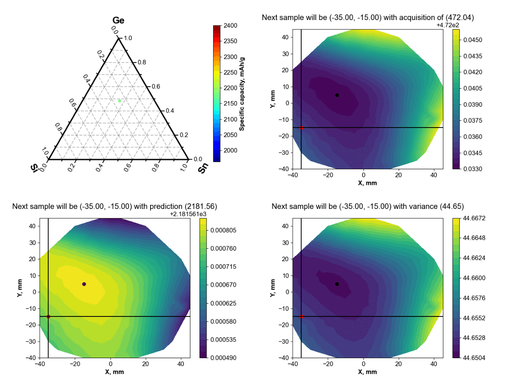

# SiGeSn

Integrating automated electrochemistry and high-throughput characterization with machine learning to explore Si-Ge-Sn thin-film lithium battery anodes

This repository contains analysis code and data generated and used for the investigation of Si-Ge-Sn ternary

The publication is available via the link (free-access): [https://doi.org/10.1002/aenm.202404961](https://doi.org/10.1002/aenm.202404961) 

